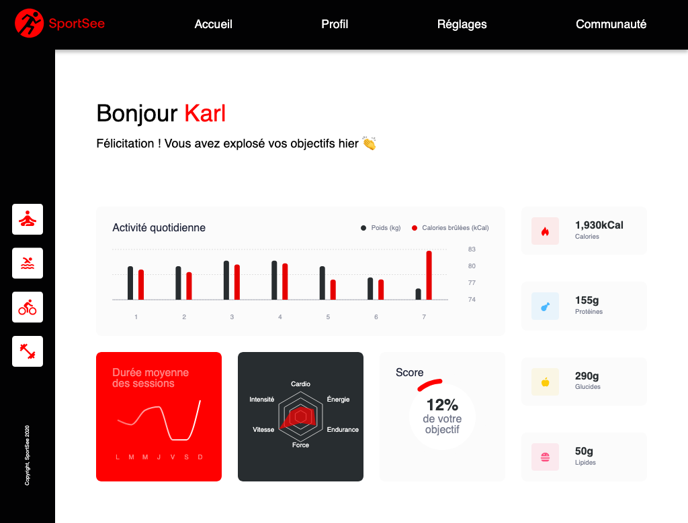

# OpenClassrooms - Projet 12 SportSee

## Description

Code source du Projet 12 - Développez un tableau de bord d'analytics avec React du parcours Développeur Front-end d'OpenClassrooms.

Selon les requirements du projet au stade actuel, le frontend est conçu pour 
correctement s'afficher sur des résolutions d'écran de 1024x780px et au-delà.


_page de l'utilisateur 12, résolution 1024x780px_

[Live preview](https://oc-p12-sportsee-git-dev-muczs-projects.vercel.app/) - site en version 
mockée hébergée sur Vercel

## Installation

Pour installer les dépendances nécessaires, utilisez la commande suivante dans le terminal :

```bash
    npm install
```

## Utilisation

L'application suit une architecture découplée: ce repo contient le frontend 
développé avec React et communique via une API avec le backend basé sur Node.js.

Repo du backend: [OpenClassrooms-Student-Center / SportSee](https://github.com/OpenClassrooms-Student-Center/SportSee)

Le frontend peut s'utiliser avec les données mockées au sein du repo
(par défaut) ou avec la connexion à l'API (valeur à modifier dans le fichier de configuration).

### Lancer l'application

#### Option 1 : Utiliser les données mockées

_Le fichier de configuration src/appConfig.ts, contient le paramètre **mocked: true** par défaut. Il récupèrera les données mockées dans **/src/data/mocked-data.ts**_

#### Option 2 : Récupération des données par API)

Cloner et lancer le backend (voir repo [OpenClassrooms-Student-Center / 
SportSee](https://github.com/OpenClassrooms-Student-Center/SportSee)).

Le backend lancé va écouter par défaut le port **3000** sur **localhost**.

Modifier le fichier de configuration **src/appConfig.ts**: passer le paramètre **mocked: false**.
_Les données seront récupérées par API sur le serveur indiqué dans le fichier de configuration : **server: "http://localhost:3000"** par défaut_

#### Lancer l'application React

Pour lancer l'application React, exécutez la commande suivante :

```bash
    npm run dev
```

Cette commande utilisera Vite pour démarrer une application de développement

### Compiler le projet

Pour compiler votre projet en production, utilisez la commande suivante :

```bash
    npm run build
```

Cette commande générera un dossier `dist` contenant les fichiers compilés.

## 🧭 Architecture de l'application

Cette application suit une structure modulaire en React + Vite + TypeScript. Ci-dessous, une vue d’ensemble du fonctionnement global du code, depuis le point d’entrée jusqu’à l’affichage des données.

### 🔹 1. Point d’entrée

- `src/main.tsx` : initialise React et monte l’application dans le DOM via `<App />`.
- `src/App.tsx` : composant racine qui configure la structure globale, le routing (`React Router`) et les composants de layout (ex. : header, sidebar).

### 🔹 2. Routage

- Géré dans `App.tsx` avec `react-router`.
- Chaque route appelle le composant de contenu correspondant dans `src/pages/`.

### 🔹 3. Pages

- Les composants dans `src/pages/` représentent des **contenus de page** (ex. : 
  dashboard, page introuvable).
- Elles consomment des **hooks** personnalisés et affichent des **composants UI**.

### 🔹 4. Hooks personnalisés

- Les hooks situés dans `src/hooks/` encapsulent la logique métier ou les appels aux données (mock ou API).
- Ils sont utilisés dans les pages pour récupérer, formater ou filtrer les données.

---

#### 📊 Exemple de flux des hooks personnalisés (dashboard d'un utilisateur, utilisation de l'API pour récupérer les données)

`<UserContent /> ⇒ useUserData ⇒ useConditionalFetch ⇒ useFetch` _appel des données_

`<UserContent /> ⇒ useUserData ⇒ useNormalisedData` _mise en forme des 
données récupérées de l'API (ou mockées)_

_Affichage des données :_
```
<UserContent />
    <DailyActivityGraph />
    <StatsGraph />
    <AverageSessions />
    <SkillsRadar />
    <ScoreGraph />
```

_Les données remontent vers et sont redistribuées par \<UserContent /> 
auprès de chaque composant._

---

### 🔹 5. Données

- `src/data/` contient une source de données mockées.
- Ces données sont typées et manipulées via les hooks.

### 🔹 6. Composants

- `src/components/` regroupe des composants UI **réutilisables**, souvent centrés sur une fonctionnalité (ex. : graphique radar, barre de score).
- Ils reçoivent leurs props depuis les pages ou des composants parents.

### 🔹 7. Styles

- Les styles SCSS sont organisés dans `src/scss/` et `src/styles/`.
- Utilisation de `Sass` pour gérer des variables et la structuration visuelle.


## 🛠️ Technologies utilisées

### 🔧 Core
- **TypeScript** `~5.8.3`
- **React** `^19.1.0`
- **React DOM** `^19.1.0`
- **Vite** `^7.0.4`
- **npm** (gestionnaire de paquets Node.js)

### 🎨 UI / Graphiques
- **Recharts** `^3.1.0`
- **Sass** `^1.89.2`
- **React Router** `^7.7.1`

### 📦 Plugins / Outils Vite
- **@vitejs/plugin-react** `^4.6.0`

### ✨ Typages
- **@types/react** `^19.1.8`
- **@types/react-dom** `^19.1.6`

### 🧹 Linting / Qualité de code
- **ESLint** `^9.30.1`
- **@eslint/js** `^9.30.1`
- **eslint-plugin-react-hooks** `^5.2.0`
- **eslint-plugin-react-refresh** `^0.4.20`
- **typescript-eslint** `^8.35.1`
- **globals** `^16.3.0`

